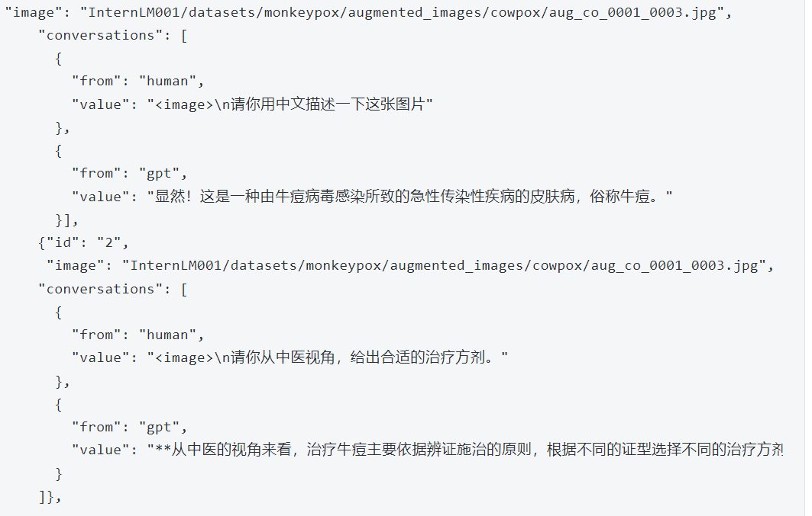
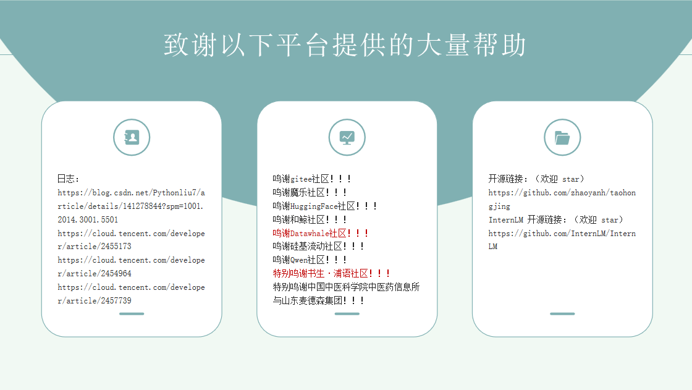

# 弘景中医药大模型
# 项目背景
### 人物介绍
陶弘景是我国本草学发展史上早期贡献最大的人物之一。在他生活的年代，本草著作有10余家之多，但无统一标准，特别古本草书由于失效年代久远，内容散乱，草石不分，虫兽无辨，临床运用颇为不便。陶弘景担负起“苞综诸经，研括烦省”的重任，将当时所见《神农本草经》及医家注解（名医别录），加上个人在这方面的心得体会，著成《本草经集注》，共收药物730种，并首创沿用至今的药物分类方法，以玉石、草木、虫、兽、果、菜、米食分类（原书已佚，现在敦煌发现残卷），成为我国本草学发展史上的一块里程碑。
陶弘景中医药大模型，包括命名实体识别，关系抽取，知识图谱构建，大模型增量微调，RAG
### 前景
中医药大模型能够通过深度学习和自然语言处理技术，挖掘和整合中医药经典理论，包括组方配伍以及临床应用信息。加速中药新药的早期发现及开发进程。
通过智能问答以及交互计算等应用模式，中医药大模型为医生提供从证到方、从方到药的辅诊疗建议，助力制定个性化治疗方案。

综上所述，中医药大模型在医疗健康领域的商业潜力巨大，不仅能够推动中医药行业的数字化转型，还能促进健康管理的智能化发展，同时为中医药文化的国际传播和市场拓展提供支持。

### 赛事
本次比赛主要由 Datawhale X 科大讯飞 X 书生·浦语。

总体要求是基于讯飞星辰Maas平台进行大模型微调并提交比赛方案，优构建一个智能中医问答系统，通过整合中医药知识，提供一个高效、准确且用户友好的问答平台。
# 项目流程

# 项目进展
### 🎉 书生·浦语
  XTuner  : 指令微调 、 增量预训练
  浦语社区: InternStudio开发机 
  🔥更好的模型永远在路上!🔥
  
   * Dec. 15,2024: 上传 微调 及 模型开发相关代码。
   * Oct. 16,2024：上传 Data Processing
 
📚 数据详情 detail
### pretrain_data
详见 master/dataset 
### 多模态数据
* Data preparation
* 经过寻找皮肤病图片，我们在和鲸社区，获取了一份猴痘皮肤图像数据集，数据库包含五种不同疾病类别的皮肤病变/皮疹图像：(1) 猴痘、(2) 水痘、(3) 天花、(4) 牛痘、 (5) 麻疹，此外还包含 (6) 健康皮肤图像.（原数据集作者还使用各种增强技术将数据量增加了 49 倍）。对书生浦语InternVL2-2B多模态大模型进行了微调尝试。
json 文件的格式 （我们构建了如下conversations对，用于与模型的训练。）

    
📅 模型列表
模型名称   	                模型类型                  Base-Model               XTuner微调 
🆕HongjingBot-VL            图文理解                InternVL2-2B               qlora_finetune
🆕HongjingBot-chat          对话                    InternLM2.5-7B-chat        qlora_alpaca_e3  full_custom_pretrain_e1
🌈 模型介绍
🎓 模型评估（暂未进行）(未找到好的基准)
👋 联系我们: 644735344@qq.com
# 快速微调与部属
### 🔓 使用方法
🆕HongjingBot-chat  

```python
lmdeploy serve api_server \
    /root/InternLM/XTuner/merged01 \
    --model-format hf \
    --quant-policy 0 \
    --server-name 0.0.0.0 \
    --server-port 23333 \
    --tp 1
```
Gradio     lmdeploy 部署自带前端
```python
lmdeploy serve gradio http://localhost:23333 \
    --server-name 0.0.0.0 \
    --server-port 6006
```
SuWen     基于MindSearch的RAG系统实现
```
python -m mindsearch.app --lang cn --model_format internlm_server --search_engine DuckDuckGoSearch
```
```
streamlit run frontend/suwen_streamlit.py
```
##### 量化部署
* 在线 kv cache int4/int8 量化
```
lmdeploy serve api_server \
    /root/models/merged01 \
    --model-format hf \
    --quant-policy 4 \
    --cache-max-entry-count 0.4\
    --server-name 0.0.0.0 \
    --server-port 23333 \
    --tp 1
```
* W4A16 模型量化和部署
```
lmdeploy serve api_server \
    /root/models/merged01 \
    --model-format hf \
    --quant-policy 4 \
    --cache-max-entry-count 0.4\
    --server-name 0.0.0.0 \
    --server-port 23333 \
    --tp 1
```
* W4A16 量化+ KV cache+KV cache 量化
```
lmdeploy serve api_server \
    /root/models/merged01-w4a16-4bit/ \
    --model-format awq \
    --quant-policy 4 \
    --cache-max-entry-count 0.4\
    --server-name 0.0.0.0 \
    --server-port 23333 \
    --tp 1
```

🆕HongjingBot-VL
启动test1
```python
conda activate lmdeploy
python test1.py
```

## 📝 License

This project is released under the [Apache 2.0 license](LICENSE).

# 项目荣誉
# 项目star
# 项目成员
🚩陆续招募ing
# 鸣谢

🤗✡️🤖

